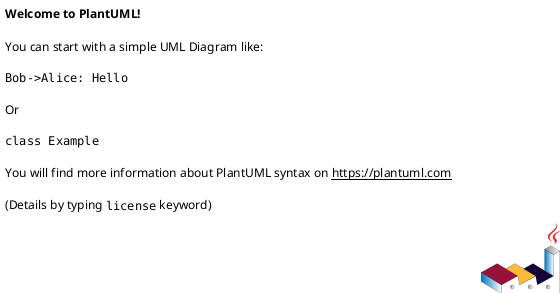
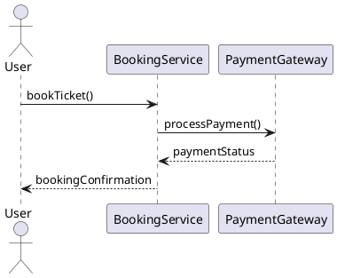
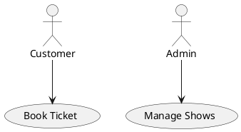
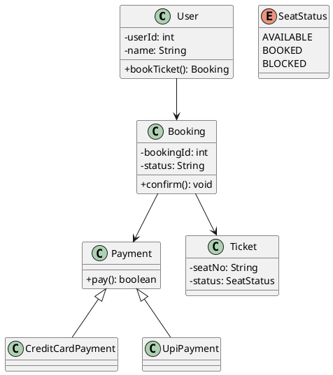

# PlantUML — UML Syntax Cheat Sheet (LLD Focus)

This README is a **complete, copyable note** for designing UML diagrams in **PlantUML**, with emphasis on **Low-Level Design (LLD)** class diagrams. Paste this into a text file named `README.md` or open it in your editor. It contains syntax, examples, and a full BookMyShow class diagram example.

---

# 📘 PlantUML UML Syntax Notes

This is a **complete reference** for designing **UML diagrams in PlantUML**, focusing on **LLD (Class Diagrams)** with extra syntax for Sequence, Use Case, and other UML diagrams.

---

## 1. Basic Setup



---

## 2. Classes

### Defining a Class

```plantuml
class ClassName
```

### Class with Attributes and Methods

```plantuml
class User {
  - userId: int
  - name: String
  + login(): boolean
  + logout(): void
}
```

* `+` → public
* `-` → private
* `#` → protected
* `~` → package

---

## 3. Abstract Class & Interface

```plantuml
abstract class Payment {
  + process(): void
}

interface INotification {
  + sendNotification(): void
}
```

---

## 4. Relationships

### Association

```plantuml
User --> Booking : makes
```

### Bidirectional Association

```plantuml
User <--> Booking
```

### Aggregation (whole–part, weak)

```plantuml
Team o-- Player
```

### Composition (whole–part, strong)

```plantuml
House *-- Room
```

### Inheritance / Generalization

```plantuml
Payment <|-- CreditCardPayment
```

### Realization (implements interface)

```plantuml
Notification <|.. EmailNotification
```

---

## 5. Multiplicity

```plantuml
User "1" --> "many" Booking
Team "1" --> "11..15" Player
```

Use numeric or range expressions: `1`, `*`, `0..1`, `1..*`, `11..15`.

---

## 6. Notes

```plantuml
class User
note right of User : Stores user info
```

Or floating note:

```plantuml
note "This is a floating note" as N1
```

---

## 7. Packages & Namespaces

```plantuml
package "Booking System" {
  class User
  class Booking
}
```

You can nest packages and add colors with `skinparam`.

---

## 8. Enum

```plantuml
enum SeatStatus {
  AVAILABLE
  BOOKED
  BLOCKED
}
```

---

## 9. Sequence Diagram (for behavior modeling)



---

## 10. Use Case Diagram



---

## 11. Miscellaneous

### Hide Class Members

```plantuml
hide methods
hide fields
```

### Skin Parameters (styling)

```plantuml
skinparam classAttributeIconSize 0
skinparam backgroundColor #EEEBDC
skinparam class {
  BackgroundColor #F5F5DC
  ArrowColor #0000FF
  BorderColor #FF0000
}
```

You can tune `skinparam` for overall diagram styling and readability.

---

## 12. Complete Example – BookMyShow (Class Diagram)

This is a compact but production-aware class diagram representing core LLD elements for BookMyShow. Paste into PlantUML to render.



---

# ✅ Key Takeaways

1. **Always start with `@startuml` and end with `@enduml`.**
2. **Class diagram is the heart of LLD.**
3. Use **composition (`*--`)** for strong ownership, **aggregation (`o--`)** for weak.
4. Use **multiplicity (`1`, `*`, `0..1`, `1..*`)** to show real-world constraints.
5. Add **notes, packages, enums** for production-grade clarity.

---

## Next steps

* Want a printed 1‑page quick reference (PDF)? I can export.
* Want a minimal 6-class BookMyShow whiteboard-ready PlantUML? I can generate it.

*End of PlantUML Cheat Sheet README*
